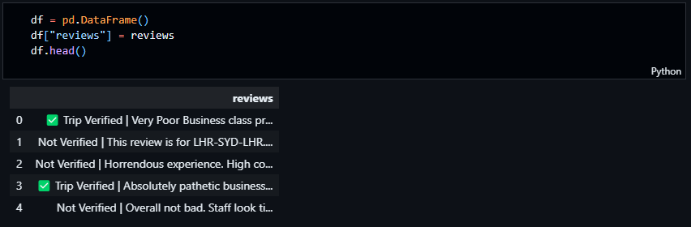
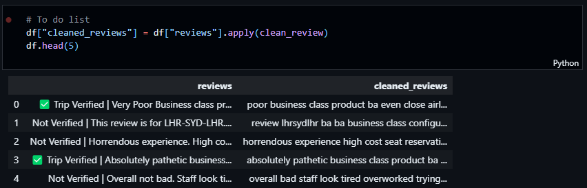

# BritishAirways-data-science

This Project is a job simulation for the British Airways Data Science role. The Major task of the Job is to help British Airways Understand their customers better regarding their experience using the services of British Airways.

## Part 1: Results

After analysing 1000 reviews of verified and non-verified flight experiences of British Airways customers, the results are presented based on the type of analysis performed.

### Topic Modeling

I used [Latent Dirichlet Allocation](https://en.wikipedia.org/wiki/Linear_discriminant_analysis#:~:text=Linear%20discriminant%20analysis%20(LDA)%2C,classes%20of%20objects%20or%20events.) (LDA) to find the topics in the reviews.

#### Rationale

LDA would allow me to find the topics in the reviews and the words that are associated with each topic. This would help British Airways understand the topics that are important to their customers and the words that are associated with each topic.

##### The top 10 topics are


### Sentiment Analysis

I used textblob to perform sentiment analysis on the reviews.
Rationale: Sentiment analysis would allow me to understand the sentiment of the reviews. This would help British Airways understand the sentiment of their customers and the words that are associated with each sentiment.

##### Pie Chart To visualize sentiment


#### WordClouds Based on Sentiment

<p>I also created wordclouds based on the sentiment of the reviews. This would help British Airways understand the words that are associated with each sentiment.</p>


## Part 2: Process for Data Analysis

I used numpy, pandas, matplotlib and seaborn libraries to analyse the data. I used jupyter notebook to write the code. The code is in the file `Data Analysis.ipynb`. The code is well documented and easy to understand. The code is divided into 3 parts:

1. Web Scraping
2. Data Cleaning
3. Data Analysis
4. Data Visualization

### Web Scraping

I scraped the data from the website <https://www.airlinequality.com/airline-reviews/british-airways/>. I used BeautifulSoup library to scrape the data. the resulting collection of 1000 reviews is saved in a csv format:



### Data Cleaning

I cleaned data by removing the verification status from each review



### Data Analysis

- I fitted an LDA model to the data and found the top 10 topics
- I found the top 10 words for each topic
- I conducted sentiment analysis on the data and found the top 10 positive and negative words

### Data Visualization

- I visualized the distribution of the LDA topic model

- I visualized the distribution of the sentiment analysis on each review

### How to reproduce the results

#### clone the repository

```git clone https:\\github.com\Simontagbor\BritishAirways-data-science.git
```

#### create a virtual environment

```python -m venv venv
```

or if you are using anaconda

```conda create -n venv
```

or if you are using mkvirtualenv

```mkvirtualenv venv
```

#### install the requirements

```pip install -r requirements.txt
```

#### run the jupyter notebook

```jupyter notebook
```

#### connect to the jupyter notebook in your browser

```http://localhost:8888/
```
